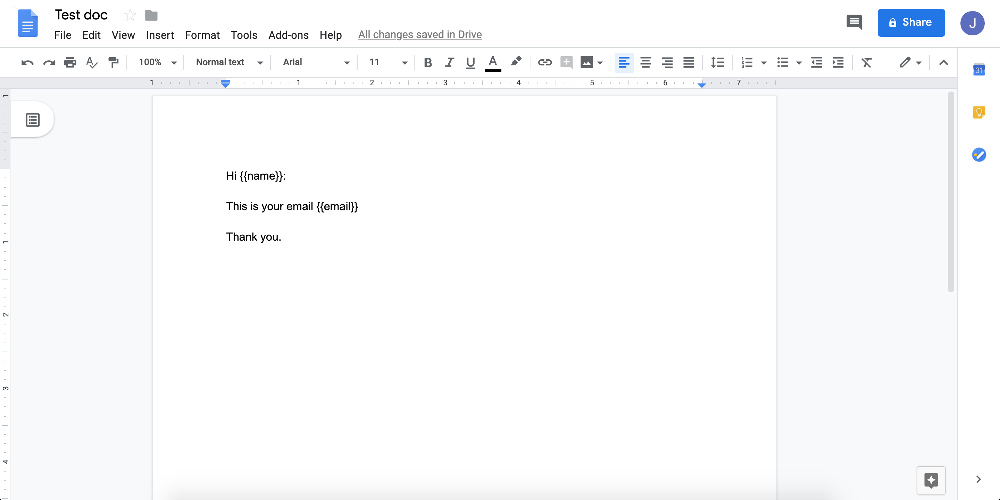
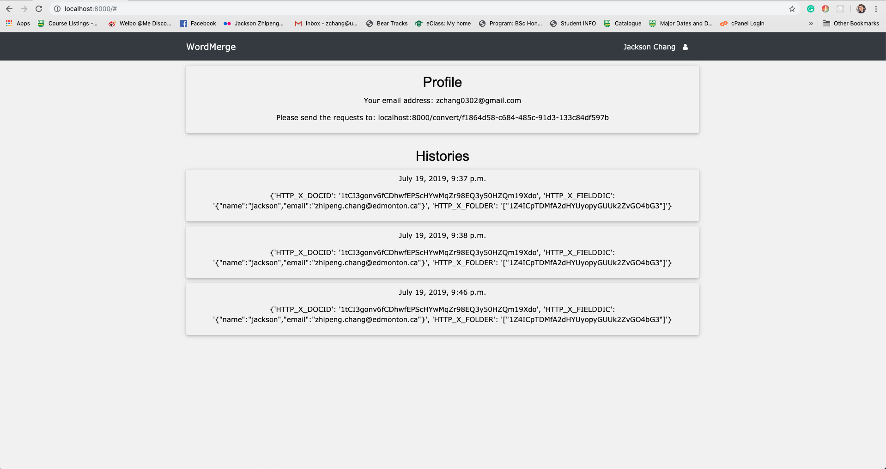
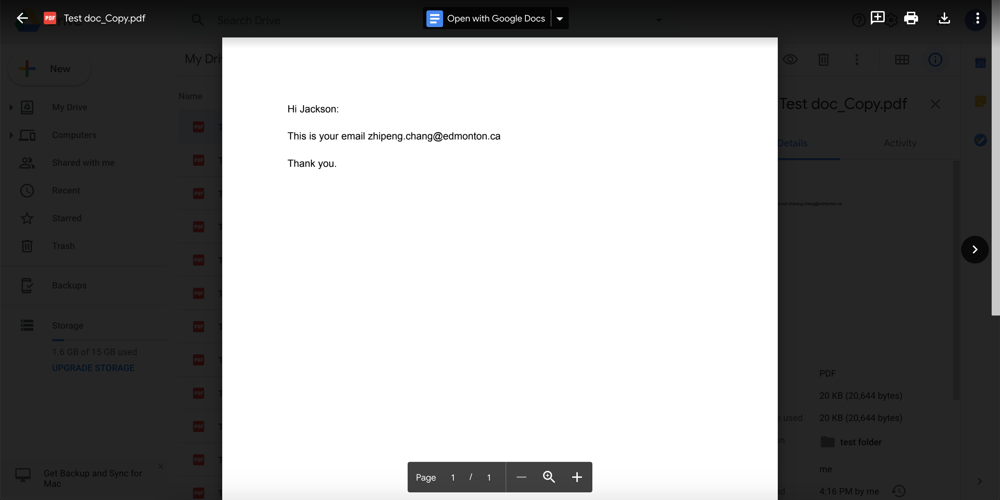

# WordMerge
## [Demo](https://drive.google.com/file/d/1EnVnQqWbGThGhjmKMfukTJ0QBjQa0PqR/view?usp=sharing)

## Description
This web API can merge your Google Docs template, convert the merged Google Doc as a PDF and save it to your Google Drive folder.

### Things can do
1. Merge the Google Docs template you defined.
2. Share the merged Google Doc/PDF with a list of users
3. Save the merged Google Doc/PDF to a specific folder
4. API interface

### How to use:
**1. Define your Google Docs template and put your variables into {{ }}**


**2. Log in with your Google account and authenticate the WordMerge app with your Google Drive.**


**3. Send the API request to ../convert/{your_assigned_uuid}, with all the variables you would like to merge** 


**4. Once the template is successfully merged, the merged Google Doc will be saved to your Google Drive and you will get the link to the PDF version of the file.**



## To run the project locally:
```
On your terminal:

# Create a virtual environment
1. virtualenv venv --python=python3

# Activate your virtual environment
2. source venv/bin/activate

# Install all dependencies
3. pip install -r requirements.txt (please note that requirements_CI.txt is for TravisCI only)

# Run database migrations
4. python3 manage.py migrate

# Create a local super user
5. python3 manage.py createsuperuser

# Run the server locally (by defult it's on http://127.0.0.1:8000/)
6. python3 manage.py runserver
```

## Codebase overview

```
wordMergeApp/
├── url.py                  # All app level endpoints 
├── GoogleDriveService.py   # Handlers all Google Drive services
├── GoogleOAuthService.py   # Handlers all Google OAuth services
├── WordMergeHandler.py     # Main entry point

wordMerg/
├── setting.py     # Settings to both wordMergeApp app and the project 
└── url.py         # All project level endpoints
```